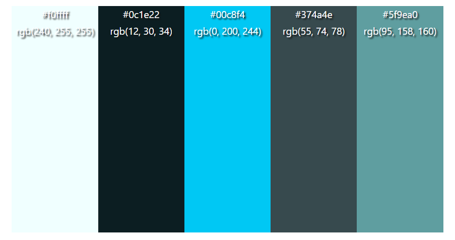
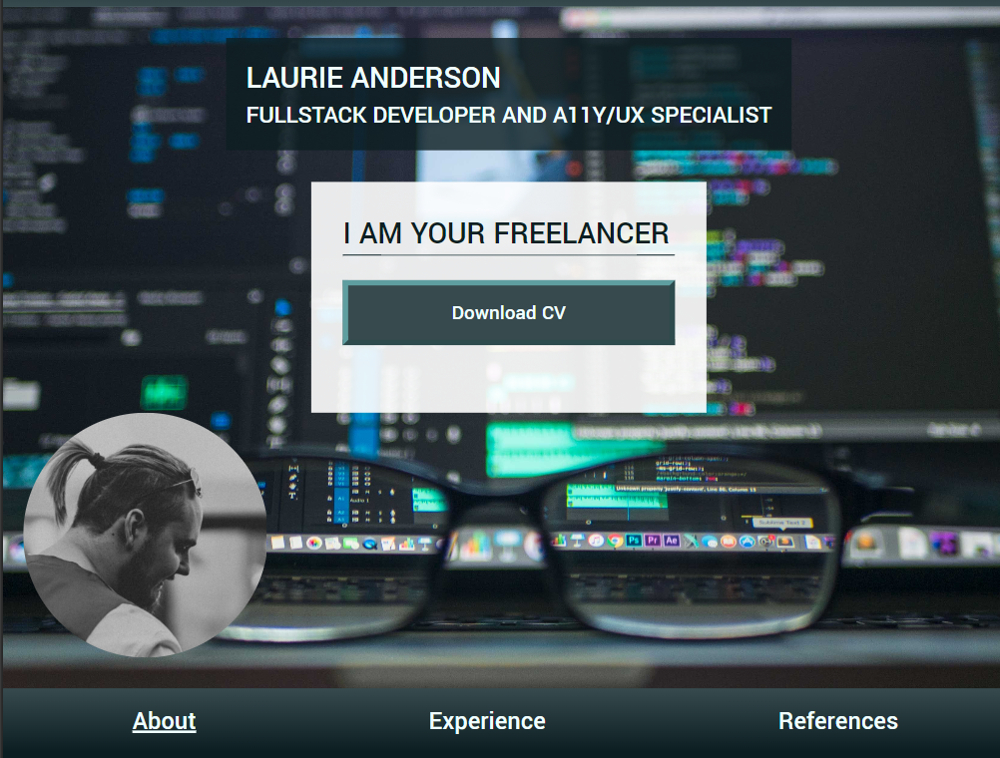
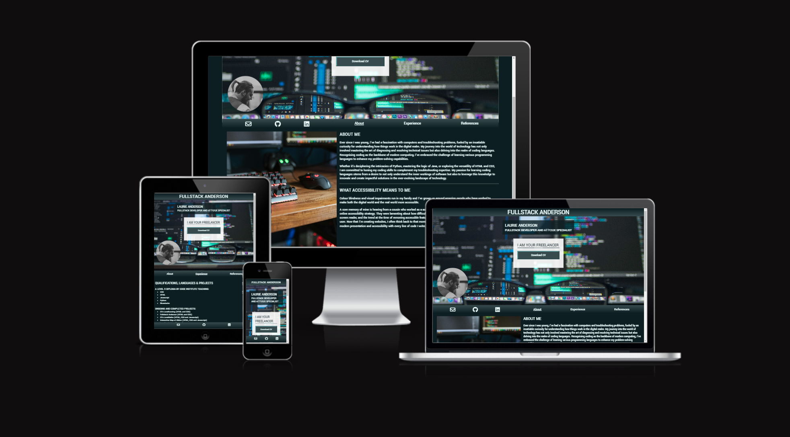
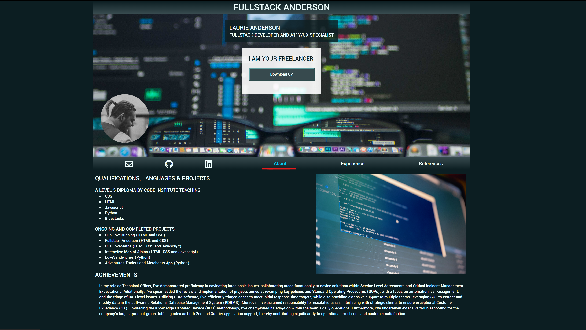
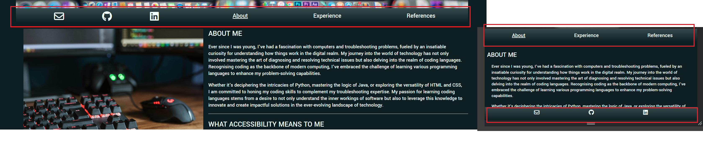
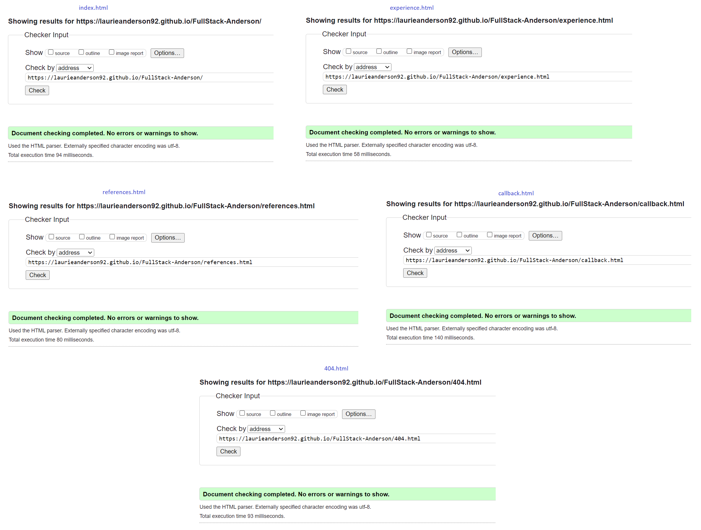
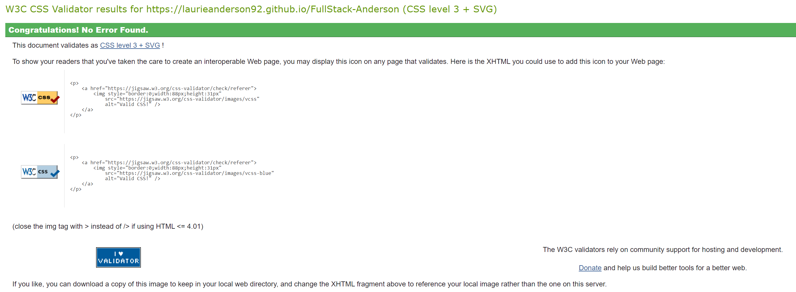
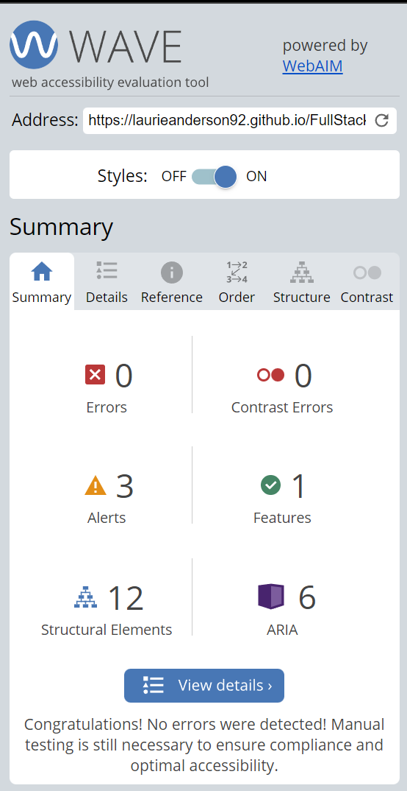

# FullStack Anderson

Welcome,

This repository contains the codebase for my personal CV website. This website serves as an online resume showcasing my skills, experience, and projects. It's designed to provide visitors with a comprehensive overview of my professional background and expertise as well as highlighting a interest in making websites accessible.

## Setup

### Technologies Used:
* **HTML:** Used for structuring the content of the web pages. 
* **CSS:** Used for styling the web pages and making them visually appealing. 
* **JavaScript:** Used for interactivity and dynamic content. 
* **Git:** Version control system for tracking changes and collaborating with others. 
* **GitHub Pages:** Hosting platform for deploying the website. 

### Wireframes

### Structure
* **index.html:** The landing page of the website, containing an overview of my profile and links to different sections in the header 
* **experience.html:** The page detailing all of my learning and professional experience  
* **references.html:** The page listing two of my most recent references publicly available on my LinkedIn, and links to their linkedIn pages 
* **callback.html:** The page to submit a callback request regaring a project. 
* **404.html:** A page made to alert the user they have gone into an inactive link. 
* **assets:** Directory containing CSS stylesheets, JavaScript files, images, and other resources used in the website. 

### Color Pallate:
I used [Colormind](http://colormind.io) to create a color palete based off my hero image, then tweeked the colors to make them higher contrast of each other.

### Deployment:
Currently the website is deployed in Git Hub Pages: https://laurieanderson92.github.io/FullStack-Anderson/ 
To deploy this page locally, you can download the files from https://github.com/LaurieAnderson92/FullStack-Anderson and run it on a brownser in your machine. 

## Features

### User Stories:
1. When a user first views the website, they'll want to immediately know what it is.
2. When a user navigates the website, it should be obvious and intuative.
3. If the user wants to find The link to the CV, it should be prominent and obvious.
4. If a user views the github respository to view the quality of the code, it should be well commented and organised.
5. For a user the style should be visually consistent and appealing.
6. If the user wants to contact me, they should be able to do so from anywhere.

### Delivery:
#### Title
Front and center of all of my pages is the title, this was stylized to look like a social media profile on any resolution following their conventions, such as a cover image and a profile picture.

This fulfills user story **1** and **3**, immediately the user knows it is a profile for a person, and the central display of the text 'I Am Your Freelancer' along with the link to the CV makes its obvious what the sites purpose is.

#### Responsiveness
The website looks good and apropriate on all resolutions and orientations, with the majority of browsing traffic bing via mobile devices, the website started small and then was scaled to bigger screens.

This fulfills user story **2** and **5**, as the site displays well, and consistently on multiple screens, whether it's a phone screen shown to a recruitment manager, or a large screen in a meeting discussing candidates.

#### Color and Narritive Theory
The hero image in the title tells the immediate story of what the website unique selling point is, accessability for compter users with occur challenges while maintaining a sleek and professional look. the picture blured with the clarioty appearing through the lenses of the glasses immediately sets the tone of the website.

By sticking with the colorscheme in that picture. The content of the page is immediately tied to that central image and what it represents. I'm also able to deploy a low-background/high-text contrasting dark theme of the website, which is both proven to lower eyestrain on users and is a growing supertrend with most businesses  to incorporate a darkmode of some kind, it is styled along with the branding of the site best highlighting how every aspect of a website can be used as a asset for a business narrative. which fufuls user story **1** and **5**

#### Navigation Bar
The navigation bar is adaptive, which is a key part of the website design. Contact icons are conventionally along the bottom on mobile pages and in prominent locations in larger resolutions.

By using the same bar that flexes around the page I'm able to avoid bulky, duplicated code that writes the same code twice and hides one on different resolutions. With the mobile view, the conact portion of the menu sticks to the bottom of the page as is convention for mobile views, and in wider resolutions it exists right under the profile image, which is a convention of social media profiles. This design fulfills user story **4** and **6**

### Future Features:
* Diffrent CSS for lightmode/darkmode
* Expand on the contact form and link it to an email inbox
* Expand on the projects with links to them in the portfolio
* Add visual interest in the divs in 4k resolution
* Start to better define my commits with clearer and catagorized commits such as 
 * feat:
 * bugfix:
 * BREAKING CHANGE:
 * style:
 * doc:
 * test:

## Quality Assurance

### Testing:
Test the website locally by navigating to the link: https://laurieanderson92.github.io/FullStack-Anderson/ 
in multiple web browsers and inspecting the page. Then changing the width of the page with the built in responsive design modee to ensure each page displays correctly. 

| **Width**     | __Chrome__ | __Firefox__ | __Edge__ | __Safari__|
| -----------:  | :--------: | :---------: | :-----:  | :-------: |
| **320px**     |     ✓     |     ✓       |     ✓    |     ✓    |
| **375px**     |      ✓    |     ✓       |     ✓    |     ✓    |
| **425px**     |       ✓   |     ✓       |     ✓    |     ✓    |
| **768px**     |        ✓  |     ✓       |     ✓    |     ✓    |
| **1024px**    |     ✓     |     ✓       |     ✓    |     ✓    |
| **1440px**    |      ✓    |     ✓       |     ✓    |     ✓    |
| **2560px**    |       ✓   |     ✓       |     ✓    |     ✓    |

### Validation
#### all .html pages pass [official W3C Validator](https://validator.w3.org/#validate_by_input)

 
#### style.css passed the [oficial W3C CSS validator (Jigsaw)](https://jigsaw.w3.org/css-validator/) 

 
#### webpages pass the [wave accessability evaluation tool](https://wave.webaim.org/report#/https://laurieanderson92.github.io/FullStack-Anderson/index.html) 

 

### Bugs & Enhancements:
I have three different categories of bugs:
* Cosmetic: a cosmetic issue that does not impact the webpage's funtionality
* Funtional: a issue that does have a impact to the webpage funtionality
* Critical: a bug that has caused a critical issue, such as a complet site down or a security vunrability.

**Bug1:** Cosmetic. The Title box displays over the nav-toggle window 
**Fix:** Deployed a Z Axis attribute to the title div and moved nav toggle window to be inline with convention 
 
**Bug2:** Cosmetic. The title-picture is displaying above the title-box 
**Fix:** Reorganised the flexbox and utilized absolute positioning for a responsive design 
 
**Bug3:** Cosmetic. Title-picture seems to be cut off, not a perfect circle 
**Fix:** Unable to reproduce as of 20/02/2024 
 
**Bug4:** Cosmetic. Title-picture was being overlapped by conact bar on large screens 
**Fix:** Moved title picture to left and up into title more to appear more like a social media profile on larger screens 
 
**Bug5:** Critical. Sensitive information in contact menu 
**Fix:** Replaced with Placeholder text initially, then the email function was rolled into the callback form 
 
**Bug6:** Funtional. Website not responsive for 4k resolution 
**Fix:** Added divs to either side to keep site compact on 4k screens, limited the centre div to 1440px max, the left and right divs are using Flex Grow 
 
**Bug7:** Accessability. Hover colour not contrasting enough 
**Fix:** according to lighhouse, the colour that was appearing on hover wasn't contrasting enough with the background. i changed colour to stronger contrast and a bright cyan 
 
**Bug8:** Funtional. Hover color was only appearing in the underline 
**Fix:** The issue was caused in the order which the CSS rules were being displayed. To fix the issue I changed the order in style.css and made the initial color inherit 
 
**Bug9:** Funtional. CV link broken 
**Fix:** a earlier update had changed name of file to fit convention, issue was fixed by replacing path with updated valid directory 

## Acknowledgments
* [Google Fonts](https://fonts.google.com) 
* [Font Awesome](https://fontawesome.com) For the comprehensive collection of icons used throughout the website. 
* [GitHub Pages](https://pages.github.com/) For hosting the website for free. 
* [Pexels](https://www.pexels.com/) photos uploaded by users to the free imaging hosting website pexels: 
  * Kevin Ku  
  * Brett Sayles  
  * Anete Lusina 
  * Pixabay 
  * Mikhail Nilov 
* [Colormind](http://colormind.io) Helping create a colour sceme based off my hero image 
* [Coloring for Colorblindness](https://davidmathlogic.com/) helping me choose a color scheme for each content page that's fully accessable 
* [Favicon IO](https://favicon.io/emoji-favicons/nerd-face) software to make a freeuse favicon 
* [Kim Britnell] (https://www.linkedin.com/in/kimbritnell/) for proof reading and suggesting edits to the text content 
* Kera Cudmore's [guide](https://github.com/kera-cudmore/readme-examples) on making a good README. 
