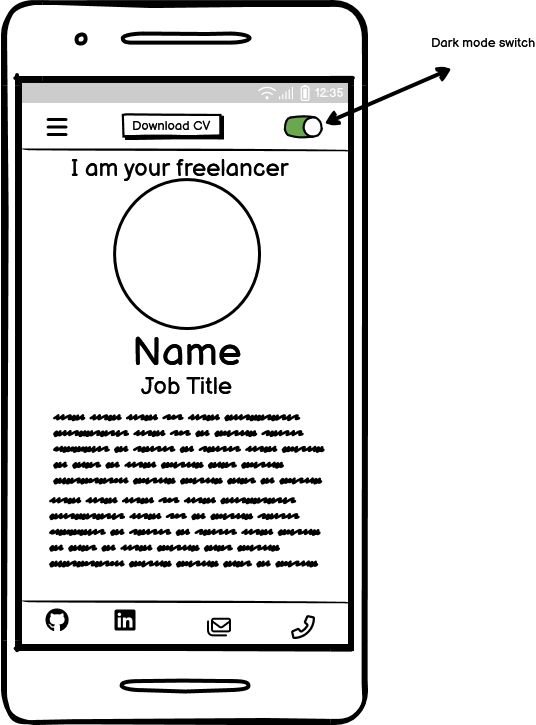
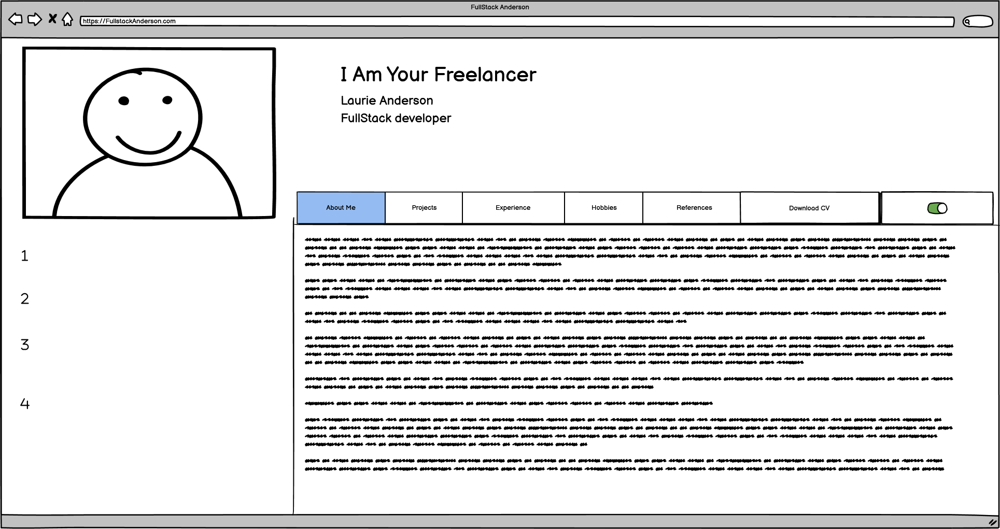
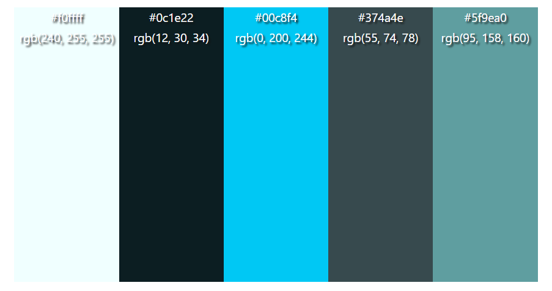

# FullStack Anderson

Welcome,

This repository contains the codebase for my personal CV website. This website serves as an online resume showcasing my skills, experience, and projects. It's designed to provide visitors with a comprehensive overview of my professional background and expertise as well as highlighting a interest in making websites accessible.

## Setup

### Technologies Used:
* **HTML:** Used for structuring the content of the web pages. 
* **CSS:** Used for styling the web pages and making them visually appealing. 
* **JavaScript:** Used for interactivity and dynamic content. 
* **Git:** Version control system for tracking changes and collaborating with others. 
* **GitHub Pages:** Hosting platform for deploying the website. 

### Wireframes

### Structure
* **index.html:** The landing page of the website, containing an overview of my profile and links to different sections in the header 
* **experience.html:** The page detailing all of my learning and professional experience  
* **references.html:** The page listing two of my most recent references publicly available on my LinkedIn, and links to their linkedIn pages 
* **callback.html:** The page to submit a callback request regaring a project. 
* **404.html:** A page made to alert the user they have gone into an inactive link. 
* **assets:** Directory containing CSS stylesheets, JavaScript files, images, and other resources used in the website. 

### Color Pallate:

### Deployment:
Currently the website is deployed in Git Hub Pages: https://laurieanderson92.github.io/FullStack-Anderson/ 
To deploy this page locally, you can download the files from https://github.com/LaurieAnderson92/FullStack-Anderson and run it on a brownser in your machine. 

## Features

### User Stories:
* When a user first views the website, they'll want to immediately know what it is.
* When a user navigates the website, it should be obvious and intuative.
* If the user wants to find The link to the CV, it should be prominent and obvious.
* If a user views the github respository to view the quality of the code, it should be well commented and organised.
* For a user the style should be visually consistent and appealing.

### Delivery:
// List of existing features in the webpage 

### Future Features:
* Diffrent CSS for lightmode/darkmode
* Expand on the contact form and link it to an email inbox
* Expand on the projects with links to them in the portfolio
* Add visual interest in the dives in 4k resolution

## Quality Assurance

### Testing:
Test the website locally by opening the HTML files in multiple web browsers to ensure everything displays correctly, in testing with myself and others a number of enhancements were suggested: 
//Inset table with testing data on multiple browsers and screen sizes.

### Validation
all .html pages pass official W3C Validator: https://validator.w3.org/#validate_by_input, Lighthouse and Wave test 
Insert Pictures 
 
styles.css passes the oficial W3C CSS validator (Jigsaw): https://jigsaw.w3.org/css-validator/ 
Insert pictures 

### Bugs & Enhancements:
// Expand on this
Bug1: The Title box displays over the nav-toggle window 
Fix: deployed a Z Axis and moved nav toggle window to be inline with convention 
 
Bug2: The title-picture is displaying above the title-box 
Fix: Used flex box and absolute positioning 
 
Bug3: title-picture seems to be cut off, not a perfect circle 
Fix: Unable to reproduce as of 20/02/2024 
 
Bug4: title-picture was being overlapped by conact bar on large screens 
Fix: moved title picture to left and into title more to appear more like a profile 
 
Bug5: Sensitive information in contact menu 
Fix: Replaced with Placeholder text 
 
Bug6: Website not responsive for 4k resolution 
Fix: added divs to either side to keep site compact on 4k screens, limited the centre div to 1440px max, the left and right divs are using Flex Grow 
 
Bug7: Hover colour not contrasting enough 
Fix: changed colour to stronger contrast 
 
Bug8: Hover colour appearing 
Fix: Changed order in style.css, made color inherit 
 
Bug9: CV link broken 
Fix: changed name of file to fit convention, replaced path with valid directory 

Enhancement1: Make the download button the complete anchor 
Status: Done 
 
Enhancement2: Image position on each content could be better 
Status: Disagree, happy with current image placements 

## Acknowledgments
Google Fonts: https://fonts.google.com/ 
Currently haven't choses a font yet, But i plan to once I build less and design more 
 
Font Awesome: https://fontawesome.com/ 
For the comprehensive collection of icons used throughout the website. 
 
GitHub Pages: https://pages.github.com/ 
For hosting the website for free. 
 
Pexels: https://www.pexels.com/photo/data-codes-through-eyeglasses-577585/ https://www.pexels.com/photo/code-on-a-screen-4383298/ 
photos uploaded by users to the free imaging hosting website pexels: 
// Make this a list
Kevin Ku  
Brett Sayles  
Anete Lusina 
Pixabay 
Mikhail Nilov 

Colormind: http://colormind.io/image/ 
Helping create a colour sceme based off my hero image 

Coloring for Colorblindness: https://davidmathlogic.com/ 
Helping me choose a color scheme for each content page that's fully accessable 
 
Favicon IO: https://favicon.io/emoji-favicons/nerd-face 
software to make a freeuse favicon 
 
Kim Britnell: https://www.linkedin.com/in/kimbritnell/ 
For proof reading and suggesting edits to the text content 